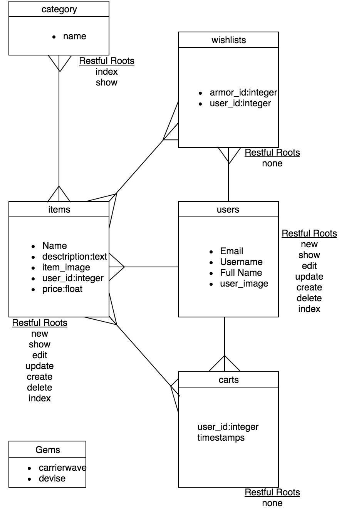
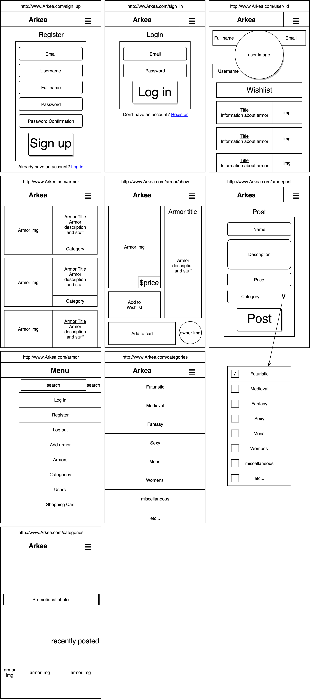
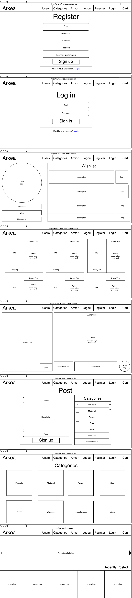
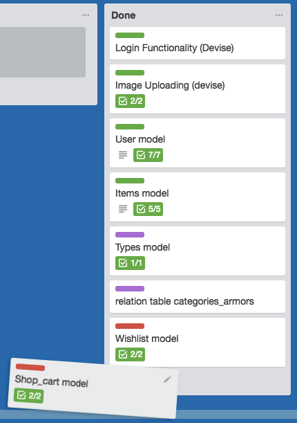

# WDI-21 PROJECT 2
##Info
Done during the course in General Assembly

Name: Arkea (Armor + Ikea)

(finished)Date: August 12, 2016

Emial: perrin.cameron@mgail.com

website: [Arkea.com](https://arkea.herokuapp.com/items)

GitHub: [Here](https://github.com/CameronPerrin/WDI_21_PROJECT2)

##Planning
###models
I created a diagram of the models
 


###templates
After I created the diagram I started to make templates for each page

* Mobile


* Desktop


* Trello


###Website Guide
When sharing to my friends I learned I'm horrible at UX. So, heres a quick guide on how to get to multiple locations.

* User's show page: Click on the user image on the user index page.
* Item's show page: Click on the item image on the item index page.
* Order Items by category: go to categories and click on the categorie to show all armor related to that category.
* Create armor: register and then click sell your armor on the top of the item index page next to the search bar.

###The Making Of
I scaffolded the the users and items and the category was a simple many to many relationship that we had learned about before. I had plenty of example to go off of for this portion. The hard part was creating the cart and the wishlist as they had no controllers of their own and relied completely on the items existence. I could get the item to add on the page load of the item show page. I then went through making javascript that would add the erb tag that added the item to the wishlist on a click. Unfortunately, that didn't work and printed the erb tag out as a string on to the page every time. the second idea I found was to from the hepl of the instructor, Chanse, and a stack overflow question that had been answered. I had to create new routes through the items that ran functions in the controller for adding the item to the wishlist to the cart. I put this in routes.rb.

```ruby
resources :items do
  member do
    post :add_to_wishlist
    put :add_to_wishlist
    post :add_to_cart
    put :add_to_cart
end
```
 
 I added these to the items controller.


```ruby
def add_to_wishlist()
  Wishlist.create(user_id: current_user.id, item_id: @item.id)
  redirect_to @item
  flash[:notice] = "Added to wishlist"
end

def add_to_cart()
  Cart.create(user_id: current_user.id, item_id: @item.id)
  redirect_to @item
  flash[:notice] = "Added to cart"
end
```

###Styling
I used foundation to set up grids for the index pages and used select2 to set up the slection bar for categories when editting or posting armor. other than that I prefer to style everything myself. I created the hamburger menu/dropdown with animation from JQuery. most things are sized with percentages so it scales down so smaller screens well. If something looked strange or overlapped I would use media query to reposition the items so it could fit better on a phone sized screen.
